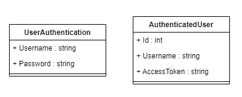
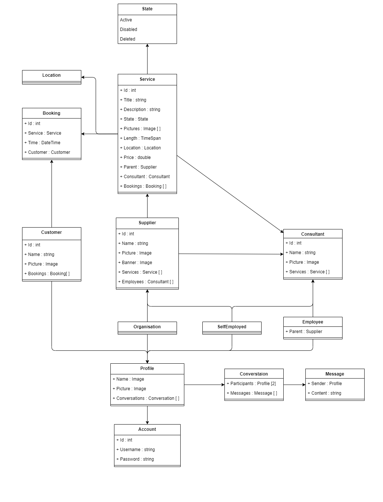

# Planning

This directory holds the main documentation created before any major developing starts.

Below are some diagrams shown, not all though. To see the entire details, enter the specific folders which contain their own readme files. The headers containhyper links to their underlying folders.

## [Use Cases](./use-cases/)

## [Models](./models/)

## [Architecture](./architecture/)

