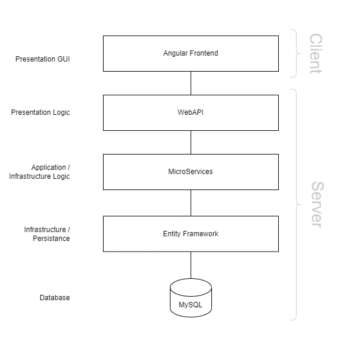

# Architecture

The Architecture is designed with DDD (Domain-driven design) in mind.

The layers are as follows:

### 1. Domain

The Domain layer is the most inner layer and contains the domain entity models. These models should reflect the business. The domain layer is where the business is expressed basically as it also hlds rules, states and other information about the business.

Domain entity models should also be POCO (Plain Old C# Class), in modern approaches though that gets a bit neglected.

The Database is **not** the center of the appliaction anymore, the domain layer should be the center.

### 2. Appliaction

The Appliaction defines the jobs the software is supposed to do. The layer is kept thin and does not contain business rules or knowledge and only coordiantes tasks and delegates.

The layer can also contain DTO (Data Transfer Object) Models, it basically serves as a bridge between the Domain and Presentation Layers.

The Application layer connects the Domain to the outside world, it is the **only** layer connected to the domain layer.

### 3. Infrastructure

The infrastructure layer contains logic for accessing external resources. It also implements technical concerns like data acessm logging, caching, messaging and general external services. This layer also interacts with external libraries / frameworks.

#### Persistance

The Persistance layer is part of the Infrastructure Layer, it is basically the Data-Access Layer. Data-Access interfaces (such as repositores) which are defined in the domain layer get implemented in this layer.

---

The rest of the architecture can be visualized as follows:

