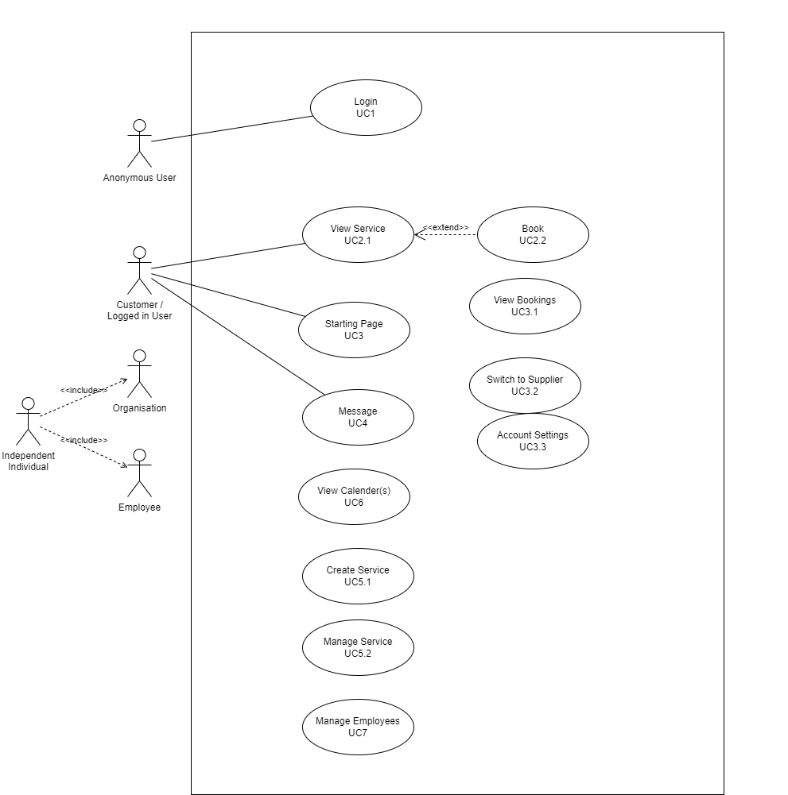

# Use-Cases

## Goals

### Wanted
- Modern Web-based application where organisations/independent individuals can book their services
- Services with different complexities can be added. Examples:
  - Group-Fitness, Restaurants, B&B, Therapy
- Notifications for both customers & suppliers (less is more) (email, phone, app? etc)
- Highly customizable services
  - Data-access (visibility e.g. amount of participants)
  - Notifications (time, message)
  - Layout on Website (e.g. Tables for a Restaurant)
  - Required Data for booking (e.g. account or only phone number/email)
  - Public / Private (or only visible when logged in)
  - Accept / Reject bookings (or auto-accept)
  - Paid and non-paid Services (different paying-methods, up-front or partial/advance payment)
  - Automatic re-invitation notification
  - Booking Time-ranges (and service-length)
  - Choose between organisation employees
  - Enable Q&A / Comments (public & private)
  - Enable Ratings
  - Allow Messaging functionality (ask specific questions that might not be publicly shared)
- Organisations and independent individuals
- Services can have multiple Owners
- Customer- & Guest-Accounts
- Ability to link existing calender (e.g. outlook, icloud) (both customer & supplier)
- BookingHive-Calender can be linked between Services (e.g. 2 different therapies of varying lengths in the same room)
- Independent individuals / employees can be linked to organisations
- Switch from supplier to customer account and vice-versa (e.g. you're self-employed but also book other services)

### Unwanted
- Item sales (services are the only products)
- Highly complex interface for service-creation

## User-Groups

### Suppliers

Provide Services

- Organisations 
- Employees
- Independent individuals

### Customers

Book Services

- Individuals 

## Functional Requirements

### Actors

| User | Goal |
| ---- | ---- |
| Anonymous User | View & book publicly visible Services |
| Customer / Logged in User | - View & book Services - View Account &emsp;- View all booked Services (past/future) &emsp;- Switch to supplier-account - View Messages |
| Organisation | - Create & Manage Services - View Calender(s) - Manage employees (if employees are used) |
| Employee | - View own Calender - Manage assigned Services - View Messages|
| Independent individual | Same as Organisation & Employee combined |

Organisations and Independent indivuduals might seem to be the exact same thing. The difference is that the latter is much more personal and also doesn't have it's own employees.

### Diagram

### Use-Cases

| UC1  | Actor1 |
| ---- | ---- |
|  asd    |  dasd    |
|    asda  |    asd  |

| UC2 | Actor2 |
| ---- | ---- |
|   asda   |    asd  |

## Non-Functionaly Requirements
| Category | Requirement | Description
| --- | --- | --- |
| | |