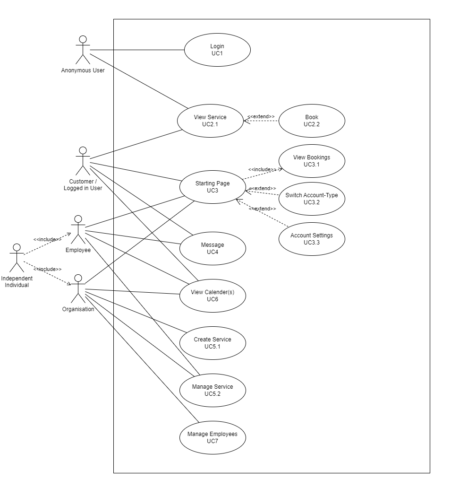

# Use-Cases

## Goals

### Wanted
- Modern Web-based application where organisations/independent individuals can book their services
- Services with different complexities can be added. Examples:
  - Group-Fitness, Restaurants, B&B, Therapy
- Notifications for both customers & suppliers (less is more) (email, phone, app? etc)
- Highly customizable services
  - Data-access (visibility e.g. amount of participants)
  - Notifications (time, message)
  - Layout on Website (e.g. Tables for a Restaurant)
  - Required Data for booking (e.g. account or only phone number/email)
  - Public / Private (or only visible when logged in)
  - Accept / Reject bookings (or auto-accept)
  - Paid and non-paid Services (different paying-methods, up-front or partial/advance payment)
  - Automatic re-invitation notification
  - Booking Time-ranges (and service-length)
  - Choose between organisation employees
  - Enable Q&A / Comments (public & private)
  - Enable Ratings
  - Allow Messaging functionality (ask specific questions that might not be publicly shared)
- Organisations and independent individuals
- Services can have multiple Owners
- Customer- & Guest-Accounts
- Ability to link existing calender (e.g. outlook, icloud) (both customer & supplier)
- BookingHive-Calender can be linked between Services (e.g. 2 different therapies of varying lengths in the same room)
- Independent individuals / employees can be linked to organisations
- Switch from supplier to customer account and vice-versa (e.g. you're self-employed but also book other services)

### Unwanted
- Item sales (services are the only products)
- Highly complex interface for service-creation

## User-Groups

### Suppliers

Provide Services

- Organisations 
- Employees
- Independent individuals

### Customers

Book Services

- Individuals 

## Functional Requirements

### Actors

| User | Goal |
| ---- | ---- |
| Anonymous User | - Login (UC1) - View (UC2.1) & book (UC2.2) publicly visible Services |
| Customer / Logged in User | - View (UC2.1) & book (UC2.2) Services - Starting Page (UC3) &emsp;- View all booked Services (past/future) (UC3.1) &emsp;- Switch to supplier-account (UC3.2) &emsp;- Account Settings (UC3.3) - View Messages (UC4) - View Calender(UC6) |
| Organisation | - Create (UC5.1) & Manage (UC5.2) Services - View Calender(s) (UC6) - Manage employees (if employees are used) (UC7) |
| Employee | - View own Calender (UC6) - Manage assigned Services (UC5.2) - View Messages (UC4) |
| Independent individual | Same as Organisation & Employee combined |

Organisations and Independent indivuduals might seem to be the exact same thing. The difference is that the latter is much more personal and also doesn't have it's own employees.

### Diagram

### Use-Cases

| UC1 | Login / Regsiter |
| --- | --- |
| Main Scenario | A account is not required to use the service, it can definitely help to keep track of booked services though. A Anonymous User can register a new account or log into an existing account. |
| Alternate Scenarios | - Anonymous users don't have a starting page like logged-in users. They need a direct link to view Services or Suppliers, since the main page does not contain a feed showing services (similar like ads). - A logged-in User lands on his starting page, showing his calender and upcoming booked services. |

| UC2 | Service - Customer |
| --- | --- |
| 1. View | - The Service-Settings can define, whether a login is required to see Services - The View-Page of a Service contains all of the neccessary information: &emsp;- Description &emsp;- Optional Pictures &emsp;- Price (if enabled) &emsp;- Avaliability &emsp;- Length (if any) &emsp;- Supplier &emsp;- etc. - Link to Booking |
| 2. Book | - The booking page shows both the Service- and Cusomer-Calender. Dates & Times that fit both parties are highlightet. - After a Date has been selected, all other informationen (defined in the service) that is required for the booking has to be filled. - After submitting the Booking, both the Customer & Supplier will get a confirmation-notification (if notifications are enabled) |

| UC3 | Starting-Page - Customer |
| --- | --- |
| Main Scenario | The Starting Page is the site a logged-in user gets directed to when logged in. It shows a summary of services/settings etc. |
| 1. Booked Services | - A calender is displayed, showing upcoming events - All Bookings (future & past) are also listed in a table. |
| 2. Switch Account | Customer- and Supplier-Accounts can be linked together. E.g. an independent individual provides services, but also wants to book other services. The switch between the accounts is seamless and doesn't require entering the username & password. |
| 3. Account Settings | - Manage Notifications - Edit Contact Details - Edit Display Name / Image - Manage default Payment options - Deactivate/Delete Account - Request User-Data |

| UC4 | Messages |
| --- | --- |
| General | BookingHive-Account have a direct link on their main-page to messages (also notifications). Messages can be used to discuss further details for Services between Customers and Suppliers |
| Customer | - Can Message a Supplier from a specific Service - Can Contact a Supplier directly without Service |
| Supplier | - Receives messages from Customers and can answer them - Can create new Bookings (invitatios) directly per-chat (e.g. a service has changed in regards to the customers specific requests) |

| UC5 | Service - Supplier |
| --- | --- |
| 1. Create | A Service has required and optional fields: - Required: &emsp;- Title &emsp;Description &emsp;- Location (direct support for online links, otherwise a map is shown) &emsp;- Calender Settings - Optional: &emsp;- Images &emsp;- Length &emsp;- Price &emsp;- Employee(s) |
| 2. Edit | - All Service-Properties can be edited later - Optionally, a notification can be sent to Customers that have booked the updated Service |

| UC6 | Calender |
| --- | --- |
| Customer | The Calender is a very important part of the website. The customer gets to see it on the starting-page and will also see it when booking services. - Other Calenders can be linked - The calender can be imported / exported - Own appointments or placeholders can be created (e.g. never available on monday) |
| Supplier | - Whole Calender, showing bookings of all services - Service-Calenders, showing all bookeings for a single service - Employee-Calenders (these are also used to show avaliability of a Service) - Supplier business-hours (e.g. 9 to 5) which get applied on all services |

| UC7 | Employees |
| --- | --- |
| Genral | A independent individual account is simply a organisation with a single employee |
| Supplier | - Can link employees to organisation and specific services (public or private visibility) - A service can contain multiple employees |
| Customer | Employees have their own Account information for Customers to view |

## Non-Functionaly Requirements
| Category | Description
| --- | --- |
| Security | - 2FA-Auth |
| Privacy | - No unreasonable data-collection - All data can be downloaded |
| Simplicity | - Service creation/booking should be smooth and simple - No complex wizards |